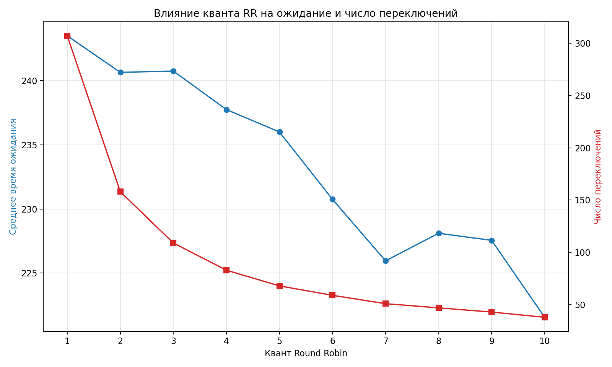

# Практическая работа № 5. Симулятор планирования CPU

## Цель работы

Реализовать алгоритмы планирования CPU и сравнить их по времени ожидания, времени оборота, времени отклика, загрузке CPU и числу переключений.

## Формат входных данных

Каждая строка содержит:

`PID arrival burst priority`

Меньшее значение `priority` означает более высокий приоритет.

Реализована единая функция:

`simulate(processes, algorithm, **params)`

Она возвращает интервалы выполнения процессов.

## Реализованные алгоритмы

- FCFS — первым выполняется раньше прибывший процесс;
- SJF — выбирается процесс с минимальным CPU-бёрстом;
- SRTF — вытесняющий SJF по минимальному оставшемуся времени;
- Priority — вытесняющее приоритетное планирование;
- Round Robin — процессы получают CPU на заданный квант;
- Priority with aging — приоритет ожидающего процесса постепенно повышается.

## Метрики

- Waiting time — суммарное время процесса в очереди Ready;
- Turnaround time — время от прибытия до завершения;
- Response time — время от прибытия до первого запуска;
- CPU utilization — доля времени, когда CPU выполняет процессы;
- Context switches — количество переключений между процессами.

## Результаты на set1

| Алгоритм | Ожидание | Оборот | Отклик | CPU, % | Переключения |
|---|---:|---:|---:|---:|---:|
| FCFS | 8.75 | 15.25 | 8.75 | 100.00 | 3 |
| SJF | 7.75 | 14.25 | 7.75 | 100.00 | 3 |
| SRTF | 6.50 | 13.00 | 4.25 | 100.00 | 4 |
| Priority | 7.00 | 13.50 | 6.00 | 100.00 | 4 |
| RR, q=3 | 13.50 | 20.00 | 3.75 | 100.00 | 9 |

SRTF и Round Robin с квантом 3 совпали с контрольным эталоном:

- SRTF: среднее ожидание 6.50, средний оборот 13.00;
- RR q=3: среднее ожидание 13.50, средний оборот 20.00.

Для FCFS непосредственный расчёт по заданным процессам даёт ожидания 0, 7, 10 и 18. Поэтому среднее ожидание равно 8.75, а средний оборот — 15.25. Указанные в условии значения FCFS 9.25 и 15.75 не соответствуют приведённым arrival и burst.

## Результаты на set2

Набор содержит 20 длительных CPU-bound процессов.

| Алгоритм | Ожидание | Оборот | Отклик | CPU, % | Переключения |
|---|---:|---:|---:|---:|---:|
| FCFS | 138.40 | 153.85 | 138.40 | 100.00 | 19 |
| SJF | 123.15 | 138.60 | 123.15 | 100.00 | 19 |
| SRTF | 121.55 | 137.00 | 112.45 | 100.00 | 21 |
| Priority | 138.45 | 153.90 | 138.45 | 100.00 | 19 |
| RR, q=3 | 240.75 | 256.20 | 27.55 | 100.00 | 109 |

SRTF показал минимальное среднее ожидание и оборот. Round Robin значительно улучшил время первого отклика, но увеличил ожидание, оборот и число переключений.

## Результаты на set3

Набор содержит один длинный и 19 коротких процессов.

| Алгоритм | Ожидание | Оборот | Отклик | CPU, % | Переключения |
|---|---:|---:|---:|---:|---:|
| FCFS | 65.35 | 70.40 | 65.35 | 100.00 | 19 |
| SJF | 60.85 | 65.90 | 60.85 | 100.00 | 19 |
| SRTF | 7.90 | 12.95 | 5.85 | 100.00 | 20 |
| Priority | 65.70 | 70.75 | 65.70 | 100.00 | 19 |
| RR, q=3 | 18.90 | 23.95 | 14.45 | 100.00 | 26 |

FCFS демонстрирует эффект конвоя: короткие процессы ждут длинный процесс. SRTF вытесняет длинный процесс после появления коротких и поэтому значительно уменьшает среднее ожидание.

## Исследование кванта Round Robin

Измерения выполнены на set2.

| Квант | Среднее ожидание | Переключения |
|---:|---:|---:|
| 1 | 243.50 | 307 |
| 2 | 240.65 | 158 |
| 3 | 240.75 | 109 |
| 4 | 237.75 | 83 |
| 5 | 236.00 | 68 |
| 6 | 230.75 | 59 |
| 7 | 225.95 | 51 |
| 8 | 228.10 | 47 |
| 9 | 227.55 | 43 |
| 10 | 221.55 | 38 |

При маленьком кванте процессы быстро получают первый отклик, но возникает много переключений контекста. При увеличении кванта количество переключений уменьшается, однако процессы дольше удерживают CPU. Зависимость ожидания не обязана быть строго монотонной, поскольку изменение кванта меняет порядок завершения процессов.

При кванте, стремящемся к бесконечности, Round Robin превращается в FCFS: каждый процесс успевает завершиться за один квант.

График сохранён в файле `rr_quantum.png`.

## Старение и голодание

В наборе `starvation.txt` процесс `LOW` имеет низкий приоритет, а короткие высокоприоритетные процессы непрерывно прибывают в систему.

Без старения:

- `LOW` впервые запустился в момент 50;
- среднее ожидание всех процессов — 0.98.

При `aging=2`:

- эффективный приоритет повышается каждые две единицы ожидания;
- `LOW` впервые запустился в момент 38;
- среднее ожидание всех процессов — 2.82.

Старение позволило `LOW` получить CPU на 12 единиц времени раньше. Среднее ожидание выросло, потому что некоторые высокоприоритетные процессы уступили CPU. Это демонстрирует компромисс между минимальным средним ожиданием и справедливостью.

При бесконечном потоке высокоприоритетных задач процесс `LOW` без aging мог бы ожидать неограниченно долго. Старение предотвращает такое голодание.

## Запуск

Примеры команд:

`python3 sched.py --algo fcfs set1.txt`

`python3 sched.py --algo sjf set1.txt`

`python3 sched.py --algo srtf set1.txt`

`python3 sched.py --algo rr --quantum 3 set1.txt`

`python3 sched.py --algo priority set1.txt`

`python3 sched.py --algo priority --aging 2 starvation.txt`

Общий анализ и построение графика:

`python3 analysis.py`

## Контрольные вопросы

### 1. Почему SJF нельзя применять в реальной ОС напрямую?

SJF требует заранее знать продолжительность следующего CPU-бёрста. В реальной системе точное время будущего выполнения неизвестно. Его можно только приблизительно прогнозировать по предыдущему поведению процесса.

Кроме того, при постоянном появлении коротких процессов длинная задача может столкнуться с голоданием.

### 2. Что происходит при кванте RR, стремящемся к бесконечности?

Процесс получает настолько большой квант, что обычно завершается до вытеснения. Поэтому процессы выполняются в порядке поступления, и Round Robin превращается в FCFS.

## Вывод

Одного лучшего алгоритма не существует. SRTF уменьшает среднее ожидание, но требует оценки оставшегося времени и создаёт дополнительные переключения. Round Robin обеспечивает хороший отклик и справедливое распределение CPU, однако маленький квант увеличивает накладные расходы. Приоритетное планирование учитывает важность задач, но требует aging для защиты низкоприоритетных процессов от голодания.
